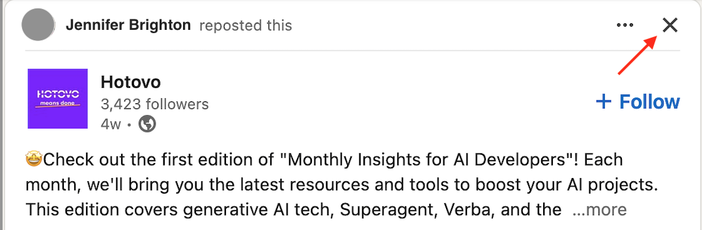
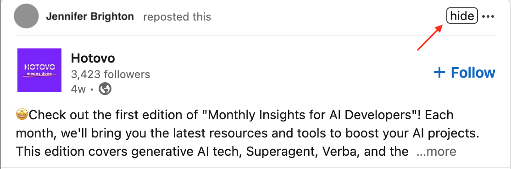

> [!NOTE]  
> At some point, LinkedIn introduced a button for hiding a post, that is located directly on the post itself,
> making this extension obsolete. Hooray! :tada:
> 

---

#  LinkedIn hide post button

Adds a button for easier hiding of posts on your LinkedIn Feed.

Saves an extra click on the `...` button and a mouse move to the `Hide` menu option (whose position in the menu is not always the same)
to hide a post in your feed.



## Supported browsers


## Installation
### Latest release
* Firefox
  * go to homepage of the extension on [Firefox Addons](https://addons.mozilla.org/en-US/firefox/addon/linkedin-hide-post-button/) and click **Add to Firefox**
* Chrome
  * go to homepage of the extension on
[Chrome Web Store](https://chrome.google.com/webstore/detail/linkedin-hide-article-but/pkgjaephjiidkkbakdnpalcccbdihlnm)
and click **Add to Chrome**

### Development
* Firefox
  * Open menu -> Add-ons (or `Ctrl` + `Shift` + `A`) -> Settings -> Install add-on from file -> Select source directory
* Chrome
  * Type `chrome://extensions/` in the address bar and hit `Enter` -> Load unpacked -> Select source directory

## Building the plugin from source

### Pre-requisites

The following dependencies with their versions are required to build the plugin.
Prior versions of these dependencies will likely work as well:
* node v8.10.0
* npm v3.5.2

To install `node` and all the `npm` modules,
run the following in terminal (required only the first time):

#### Linux
```
apt-get install node
npm install
```
#### OS X
```
brew install node
npm install
```
To build the plugin, run:
```
gulp
```
This will create a **dist** directory which contains all the plugin content
with minified code, along with a .zip archive required for web stores.

## Contributors
* [Anja Radenovic](https://www.linkedin.com/in/anjaradenovic)
* [Tomo Radenovic](https://www.linkedin.com/in/tomoradenovic)
* [Danilo Radenovic](https://www.linkedin.com/in/daniloradenovic)
